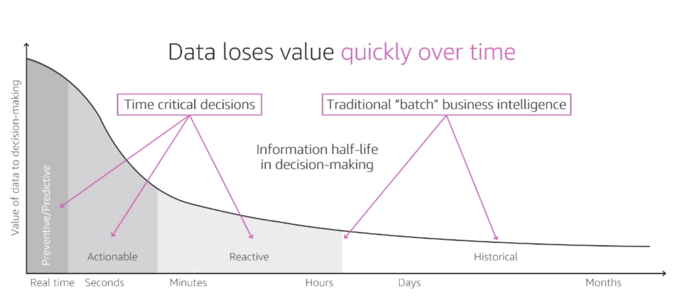
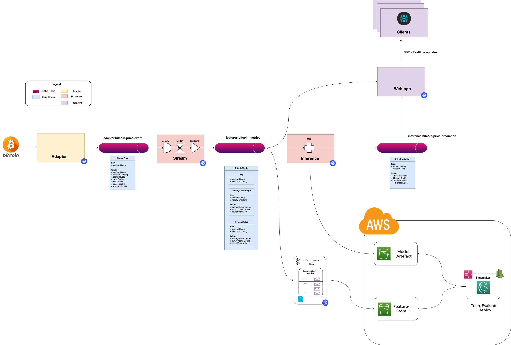
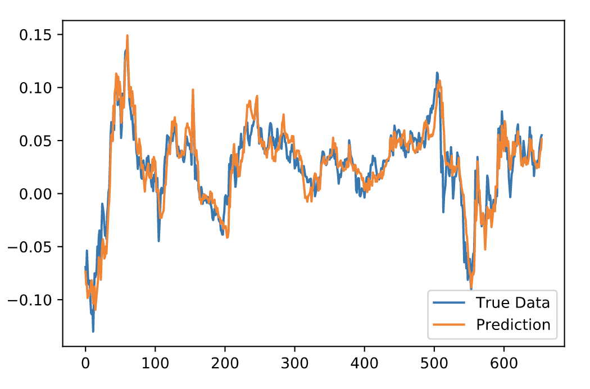
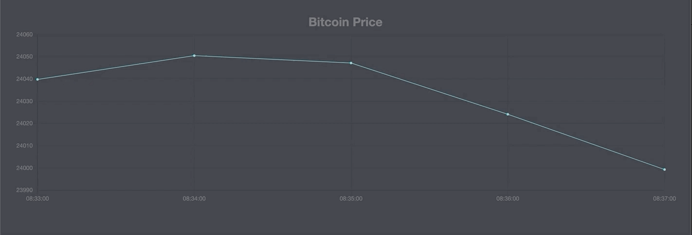

# Bitcoin Price Prediction
## Project Overview

Predict bitcoin prices using deep learning, with the primary focus being realtime feature engineering and low latency inference from a live event stream. 

*Note best practises have not be applied for model training and evaluation components.*
## Time Value of Data


For most modern applications much of the value comes from driving an action in response to a business event or user behaviour. Unfortunatley, most machine learning systems rely on after the fact batch processes - due to the immense challenge of reliably cleaning, transforming and merging multiple sources of data in order to make a single model prediction.





# Project Stack

* **K8s** - Container Orchestraion
* **Kafka** - Event Store
* **Schema Registry** - Schema validation of kafka events
* **Kafka Streams** - Stream processing
* **S3** - File System, Landing Zone for streaming data and store for model artefacts.
* **Keras Tensorflow 2** - Framework for building, testing and hyperparameter tuning LSTM network.
* **Deeplearning4J** - Serializes model so inference can be performed locally by Kafka Consumer rather than making an additional rest call which significantly reduces latency.
* **SSE & React Front-end** - Node application consumers model features and streams them to a React Dashboard which renders model visuals in a dashboard in realtime.


## Real-time ML - Solution Archetecture Diagram



## Infrastructure

All infrastructure can run on k8s (see [data-platform](https://github.com/StuartLox/data-platform)) or run locally using `deploy/kafka/local/docker-compose.yaml`

## Service 1: Bitcoin Price Adapter

Kotlin service ([bitcoin-price-adapter](https://github.com/StuartLox/trading-bot/blob/master/services/bitcoin-price-adapter/src/main/kotlin/com/stuartloxton/bitcoinprice/adapter/ReactiveWebsocketHandler.kt)) listens to a websocket from `binance.com` and streams realtime pricing (High, Low, Open Close) events to the `adapter.bicoin-price-events` topic on Kafka. Pricing data is produced every 3-5 seconds.
## Service 2: Bitcoin Price Events

Kotlin service responsible for building each of the model features (Rolling average price and average true range) which are produced to a single topic every minute. Service then consumes feature topic and makes a 10-step lookahead time series prediction. *Note model at least 50mins of data to make a prediction as it will run from latest*

### Kafka Streams Pipeline
<details>
<summary>Code</summary>

```kotlin
package com.stuartloxton.bitcoinprice.streams.metrics

import com.stuartloxton.bitcoinprice.BitcoinMetricEvent
import com.stuartloxton.bitcoinprice.BitcoinMetricEventWindow
import org.springframework.beans.factory.annotation.Autowired

import com.stuartloxton.bitcoinpriceadapter.Stock
import org.springframework.stereotype.Component


@Component
class BitcoinMetric: Metric<BitcoinMetricEvent> {

    @Autowired
    lateinit var averagePrice: AveragePrice

    @Autowired
    private lateinit var atr: ATR

    override fun identity(): BitcoinMetricEvent = BitcoinMetricEvent.newBuilder()
        .setAtr(atr.identity())
        .setAvgPrice(averagePrice.identity())
        .build()

    override fun aggregator(newStock: Stock, current: Any): BitcoinMetricEvent {
        val currentMetricEvent = current as BitcoinMetricEvent
        val bitcoinMetricEventBuilder: BitcoinMetricEvent.Builder = BitcoinMetricEvent.newBuilder(currentMetricEvent)

        // Construct Metrics
        val avgPrice = averagePrice.aggregator(newStock, currentMetricEvent.getAvgPrice())
        val atrEvent = atr.aggregator(newStock,  currentMetricEvent.getAtr())

        // Set Fields
        val bitcoinMetrics = bitcoinMetricEventBuilder
            .setAvgPrice(avgPrice)
            .setAtr(atrEvent)
        // Build new Metrics object
        return bitcoinMetrics.build()
    }

    fun windowBuilder(symbol: String, windowEnd: Long): BitcoinMetricEventWindow {
        val avgPriceWindow = BitcoinMetricEventWindow.newBuilder()
            .setSymbol(symbol)
            .setWindowEnd(windowEnd)
            .build()
        return avgPriceWindow
    }
}
```
</details>

### Feature 1. Average True Range
<details>
<summary>Code</summary>

```kotlin
package com.stuartloxton.bitcoinprice.streams.metrics

import com.stuartloxton.bitcoinprice.AveragePriceEvent
import com.stuartloxton.bitcoinpriceadapter.Stock
import org.springframework.stereotype.Component

@Component
class AveragePrice: Metric<AveragePriceEvent>  {

    override fun identity(): AveragePriceEvent =
        AveragePriceEvent.newBuilder()
            .setAveragePrice(0.0)
            .setSumWindow(0.0)
            .setCountWindow(0)
            .setVolume(0.0)
            .setClose(0.0)
            .build()

    override fun aggregator(newStock: Stock, current: Any): AveragePriceEvent {
        val avgPriceMetric = current as AveragePriceEvent
        val averagePriceBuilder: AveragePriceEvent.Builder = AveragePriceEvent.newBuilder(avgPriceMetric)
        // Calc Fields
        val sumWindow = avgPriceMetric.getSumWindow() + newStock.getClose()
        val countWindow = avgPriceMetric.getCountWindow() + 1
        val calcAvgPrice = sumWindow / countWindow

        // Set Fields
        val newAveragePrice = averagePriceBuilder
            .setSumWindow(sumWindow)
            .setCountWindow(countWindow)
            .setAveragePrice(calcAvgPrice)
            .setVolume(newStock.getVolume())
            .setClose(newStock.getClose())

        // Build new AveragePrice object
        return newAveragePrice.build()
    }
}
```

</details>

### Feature 2. Average True Range
<details>
<summary>Code</summary>

```kotlin
package com.stuartloxton.bitcoinprice.streams.metrics

import com.stuartloxton.bitcoinprice.ATREvent
import com.stuartloxton.bitcoinpriceadapter.Stock
import org.springframework.stereotype.Component
import java.lang.Math.abs


@Component
class ATR: Metric<ATREvent> {
    override fun identity(): ATREvent = ATREvent.newBuilder()
        .setAverageTrueRange(0.0)
        .setTrueRange(0.0)
        .setSumWindow(0.0)
        .setCountWindow(0)
        .setClose(0.0)
        .build()

    override fun aggregator(newStock: Stock, current: Any): ATREvent {
        val atrMetric = current as ATREvent
        val atrBuilder: ATREvent.Builder = ATREvent.newBuilder(atrMetric)
        // Calc Fields
        val countWindow = atrMetric.getCountWindow() + 1

        val v1 = newStock.getClose() - newStock.getLow()
        val v2 = abs(newStock.getHigh() - newStock.getClose())
        val v3 = abs(newStock.getLow() - newStock.getClose())

        val trueRange = maxOf(v1, v2, v3)
        val atr = trueRange / countWindow

        // Set Fields
        val newAtr = atrBuilder
            .setCountWindow(countWindow)
            .setClose(newStock.getClose())
            .setTrueRange(trueRange)
            .setAverageTrueRange(atr)

        // Build new AveragePrice object
        return newAtr.build()
    }
}
```

</details>

### Model Inference Component


<details>
<summary>Code</summary>

```kotlin
package com.stuartloxton.bitcoinprice.streams

import org.deeplearning4j.nn.modelimport.keras.KerasModelImport
import org.nd4j.linalg.api.ndarray.INDArray
import org.nd4j.linalg.factory.Nd4j
import org.nd4j.linalg.io.ClassPathResource
import org.slf4j.LoggerFactory
import org.springframework.stereotype.Component

@Component
class Inference {
    private val mPath = "model.h5"
    private val lstm = ClassPathResource(mPath).getFile().getPath()
    private val model = KerasModelImport.importKerasSequentialModelAndWeights(lstm, false)
    private val logger = LoggerFactory.getLogger(javaClass)

    private fun buildTensor(): INDArray {
        val timeSteps = 50
        val rows = 1
        val columns = 2
        return  Nd4j.zeros(rows, columns, timeSteps)
    }

    fun getPrediction(data: List<List<Double>>): Double {
        val features = buildTensor()
        if (data.size == 50) {
            data.forEachIndexed { index, it ->
                logger.info("AVG Price - ${it.get(0)}")
                // Average Price
                features.putScalar(intArrayOf(0, 0, index), it.get(0))
                // ATR
                features.putScalar(intArrayOf(0, 1, index), it.get(1))
            }
            logger.info("Size - ${data.size} Performing prediction")
            return model.output(features).getDouble(0)
        }
        else {
            logger.info("Size - ${data.size} Not enough data to perform prediction")
            return -1.0
         }
    }
}
```
</details>

## LSTM model predictions

Graph below shows look ahead LSTM model predictions during model testing.



## SSE & React Dashboard

Node app consumes model features from Kafka and Then server-sent events (SSE) to React Dashboard. GIF below shows rolling average bitcoin price updating in realtime.



## Possible Extensions
 
* Introduce policy to determine whether to buy, hold or sell given price prediction.
* Extend portfolio to include multiple fincnaical instruments, rather than just bitcoin.
* Build sagemaker pipeline so model training, hyperparameter tuning and evaluation can be automated and run on a monthly schedule.
* Get app to cache latest model on startup
* Extend model to include additional financial indicators and track performance of model and trading policy.